# AHP Log Viewer User Guide

## Open a JSONL log

Run the viewer from the repository root with a JSONL file path:

```bash
pnpm exec tsx packages/cli/src/index.ts path/to/log.jsonl
```

For a built CLI smoke test, build first and run:

```bash
pnpm -F @ahp-viewer/ui build
pnpm -F @ahp-viewer/cli build
node packages/cli/dist/index.js path/to/log.jsonl
```

The CLI prints a loopback URL, opens the browser by default, and serves the UI locally from `127.0.0.1`.

## Launching without a file

You can run the viewer without specifying a log file:

```sh
ahp-viewer
```

The browser opens to a picker showing logs the viewer discovered automatically under the standard VS Code log roots for macOS, Windows, and Linux. Pick a log to begin streaming, or paste a local log file path under "or open manually".

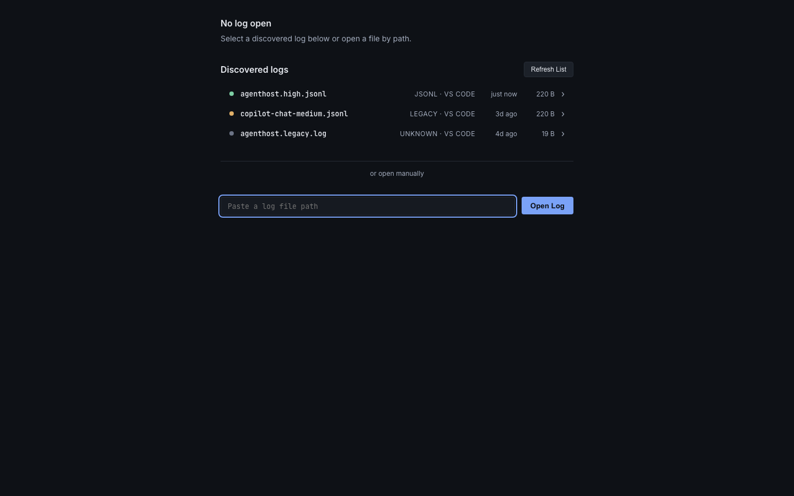

## Inside VS Code (extension)

If you install the bundled VS Code extension (`packages/extension`), open
the command palette and run **AHP Log Viewer: Open**. The viewer appears
in a webview panel in the active editor column. The same React UI runs
inside the webview; the extension host owns log discovery, file watchers,
and the in-memory event store and talks to the webview over typed
`postMessage` requests — no loopback HTTP server is started.

If a `.jsonl` file (or a file with `ahp` / `ahp-log` / `ahp_log` in its
name) is the active editor when you run the command, that file is
preselected as the initial log and starts streaming immediately.
Otherwise the same picker shown for browser launches appears, listing
discovered VS Code log roots.

## The log picker

- **Confidence dot** — green (JSONL), amber (Legacy heuristic match), grey (unknown).
- **Origin badge** — VS Code, VS Code Insiders, or Manual.
- Each row shows the file basename, an origin chip, the time since last modification, and the file size.
- Click "Refresh List" to rescan.

The picker never reveals absolute paths; it shows only basenames and short context labels relative to the discovery root.

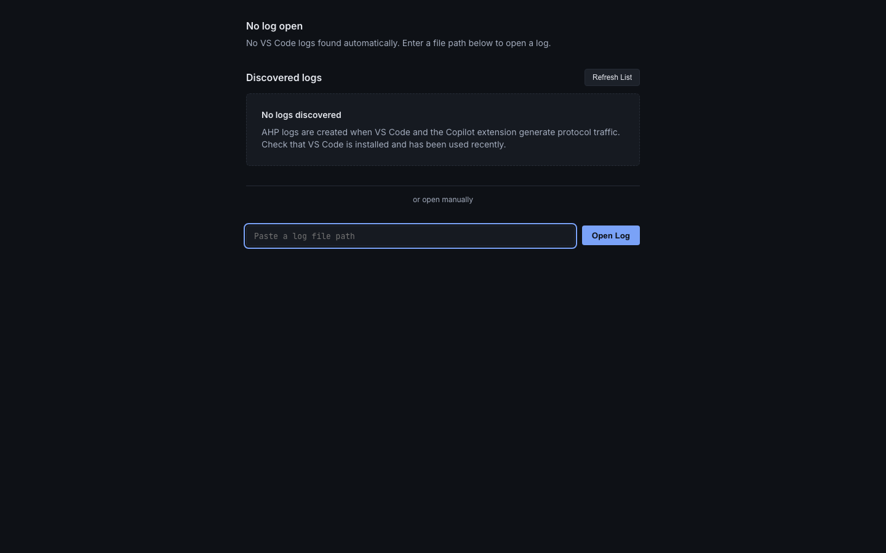

## Live tail and pause

The viewer streams new events as the file grows. Use the **Pause** button in the header to freeze the timeline; new events accumulate and a "<N> new events" pill appears at the bottom. Click the pill to flush the buffer and resume. Pause is local to the browser — the server keeps reading.

The Space key toggles pause when focus is outside form fields.

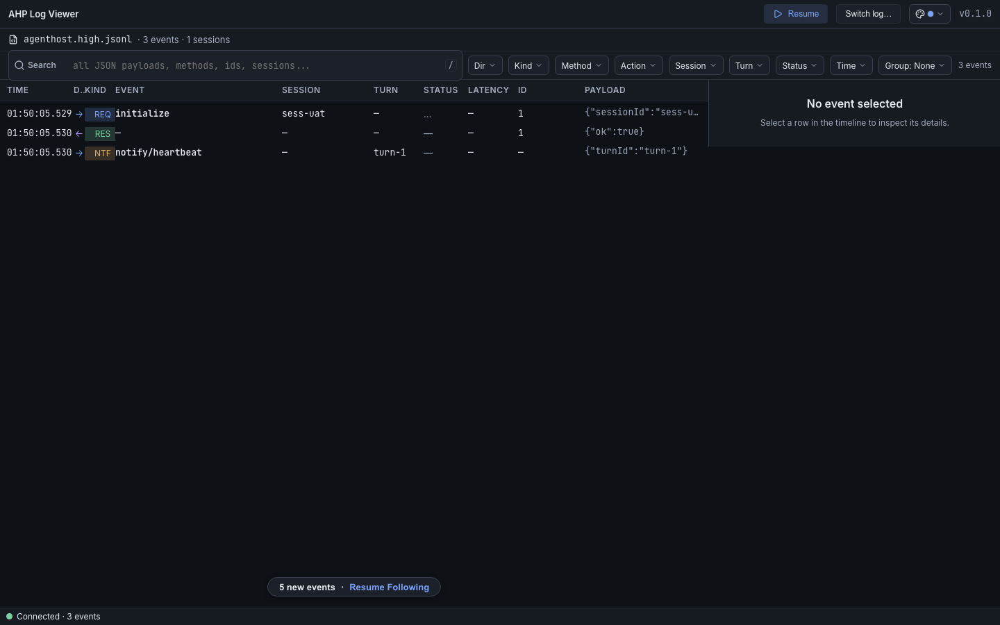

## Switching logs

Click **Switch log** at any time to open the same picker over the current view. Selecting a different log resets the timeline.

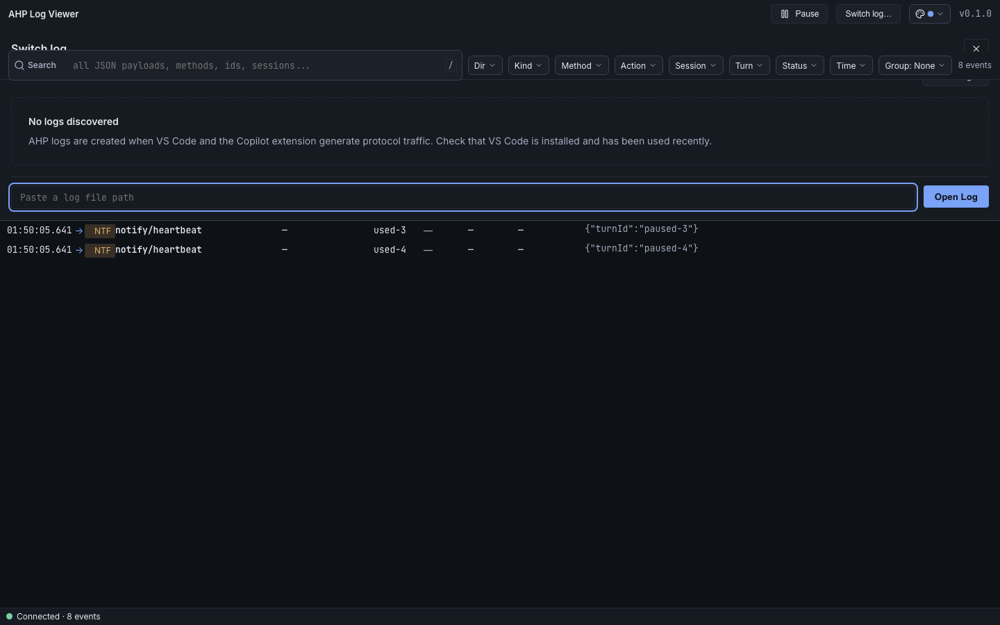

## Persistence

Filter selections, column visibility, expanded groups, and the currently-selected event are remembered per-log in your browser's localStorage. Reloading the page restores them. Up to 50 logs are remembered (least-recently-used logs are evicted).

## Banners

- **Log rotated — reloading from new file.** — Appears once when the active file rotates (truncate/rename). The viewer continues from the new file.
- **Watch error: file read error** or **Watch error: watcher stopped** — Appears if the OS file watcher reports a safe error code. Click **Retry Connection** to reconnect or **Reopen log** to reopen the active file.

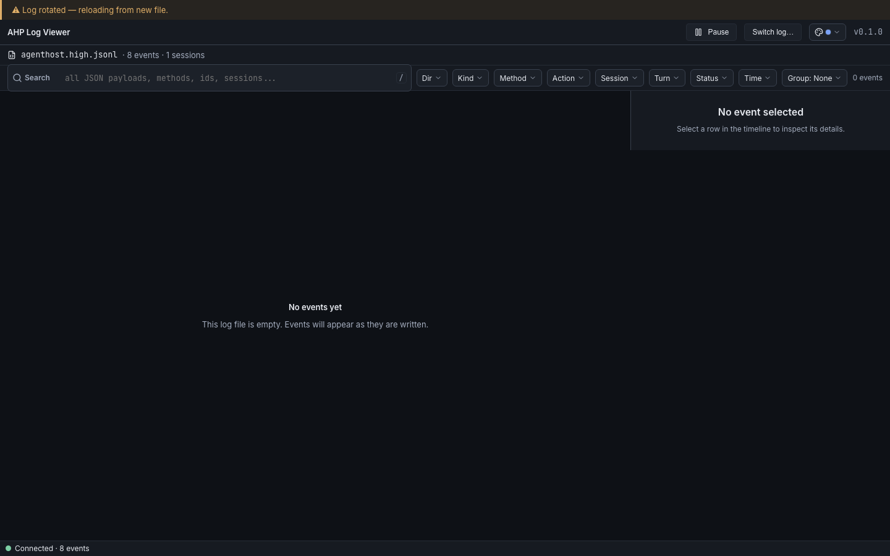

## Choose a theme

Use the compact theme picker in the header to switch between **Dark**, **Light**, and **Hacker**. The selection is saved in the browser and applies to the timeline, filters, detail panel, and Pretty JSON syntax colors.

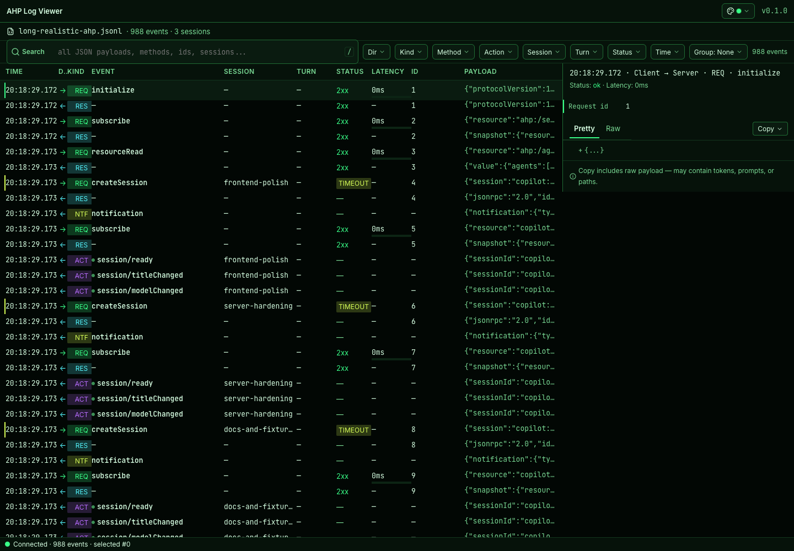

## Read the timeline

The main timeline is a dense, virtualized grid with fixed column labels. Rows now scan from left to right as **ID → Time → Dir → Kind → Event → Session → Turn → Latency → Summary**. The standalone Status column was removed; error and warning states remain visible through the row rail and inline badges such as `ERR`, `AUTH`, `TIMEOUT`, and `ORPHAN`.

The **Summary** column replaces the old generic payload preview. It shows event-specific parsed text such as `resourceList uri=safe-resource.md`, `delta "..."`, `tool call readFile ...`, `tool result ...`, or `error -32001: ...`. Session and Turn columns populate when those values are present in the JSONL, including nested action/notification shapes.

Selecting a request row highlights its correlated response when that response is visible. Selecting a response highlights its request. If filtering hides the pair, the selected row carries accessible copy explaining that the correlated request or response is hidden by current filters.

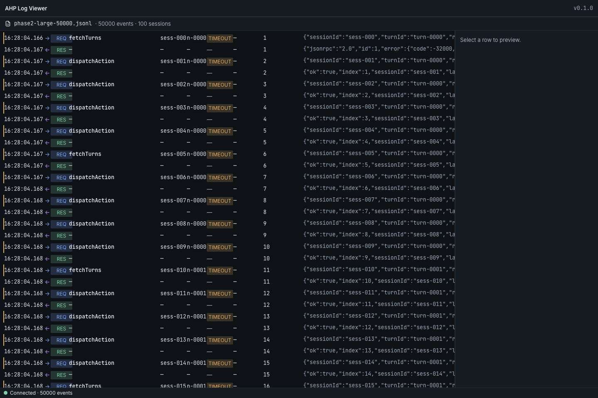


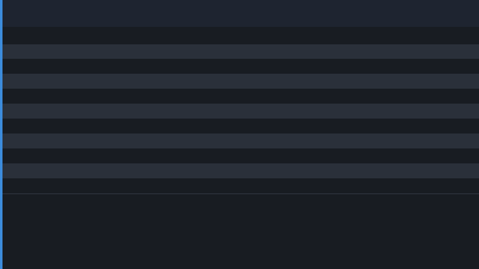

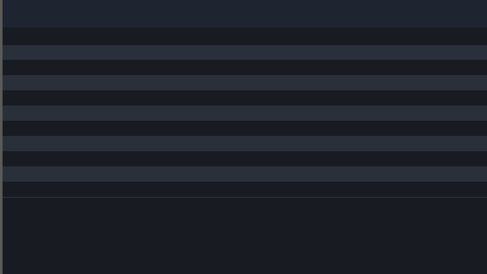

Large logs stay virtualized; a 50,000-line synthetic JSONL log renders only the visible rows while scrolling.

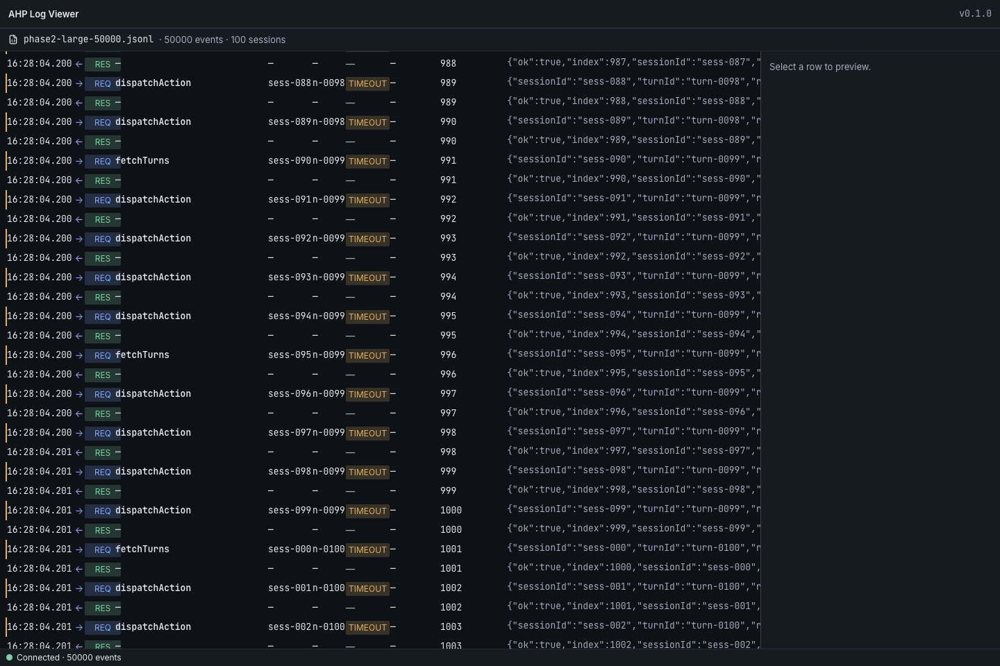

## Screen states

If the browser UI is open without the local API server, it shows the CLI command hint.

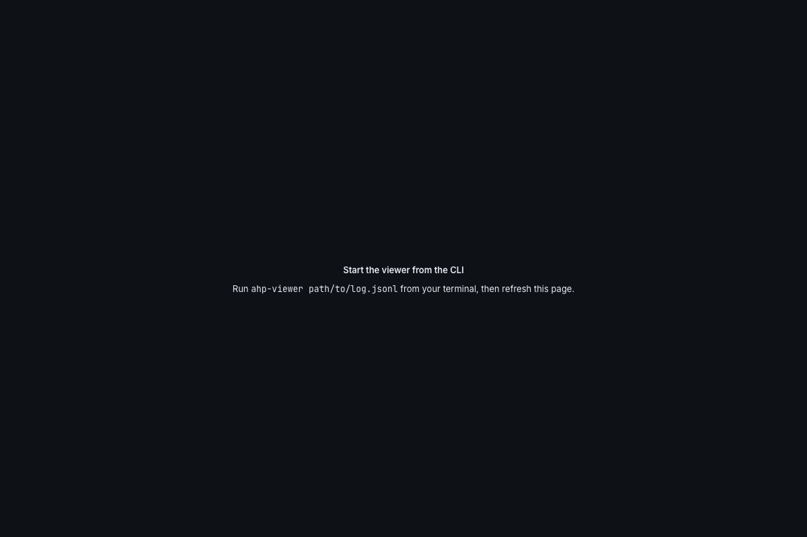

An empty JSONL file renders an informative empty state.

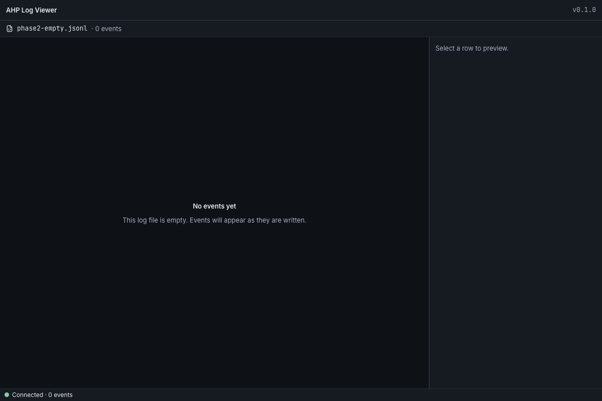

If every line fails to parse, the viewer shows a no-valid-events banner and parse-error rows.

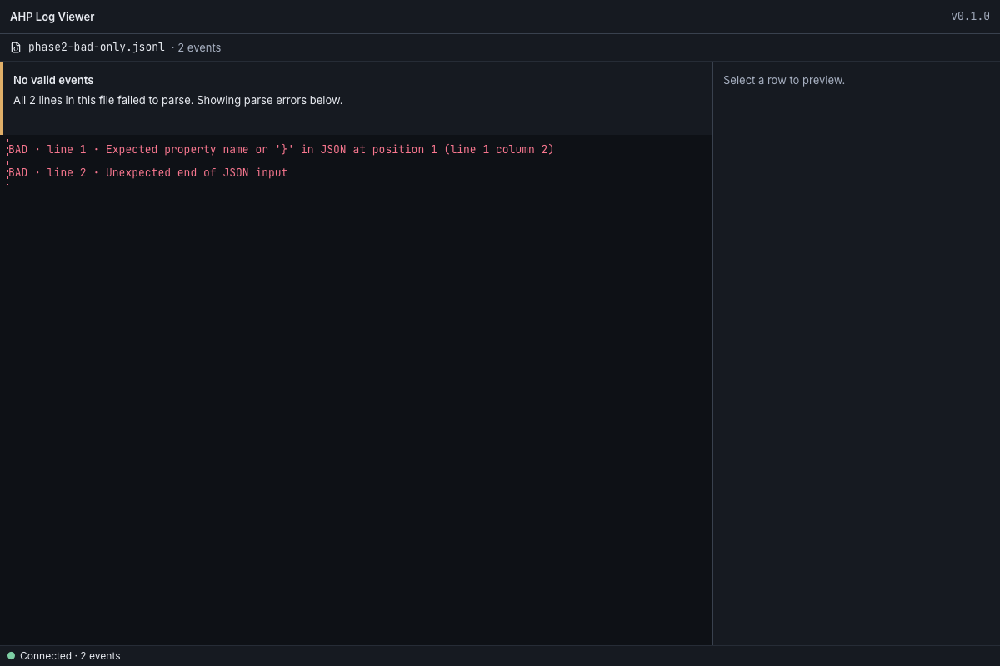

If the log stream disconnects after data has loaded, the viewer keeps the last rows visible and shows a retry banner.

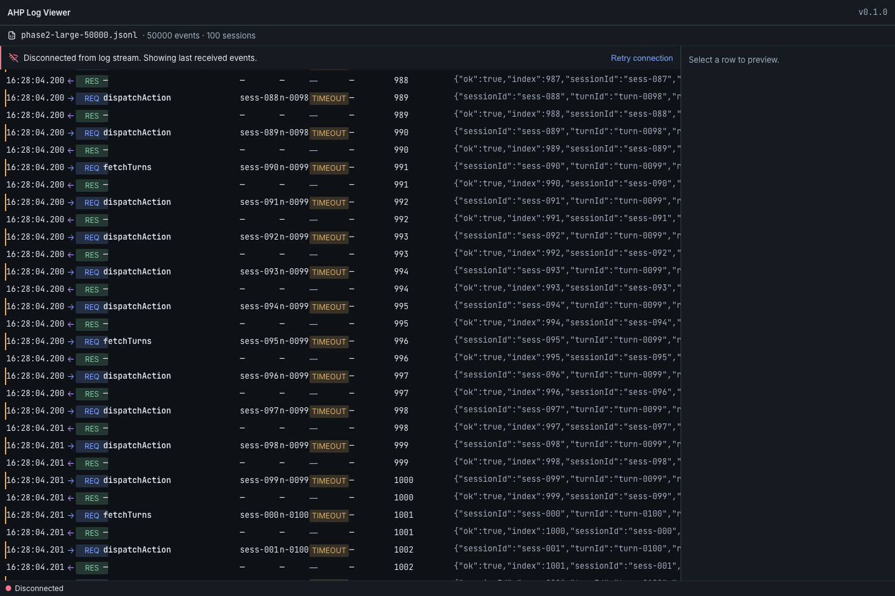

## Current limitations

The current standalone app opens one log at a time. Multi-log comparison, export workflows, advanced dashboards, and VS Code extension packaging are deferred.

## Searching events

The search bar (top of the filter bar) performs a case-insensitive full-text substring search across event method names, action types, IDs, session IDs, turn IDs, error text, and payload text. Search finds, counts, highlights, and navigates matching events without hiding the surrounding timeline context.

- Press **`/`** from anywhere to focus the search input.
- Use the **Prev** and **Next** search buttons, or press **`F3`** / **`Shift+F3`**, to move between matching rows.
- Press **`Esc`** to clear the search query (press again to clear active filters, then again to deselect the current row).
- Results are capped at **5,000 matches** to keep scrolling smooth on large logs. A "truncated" indicator appears when the cap is reached.

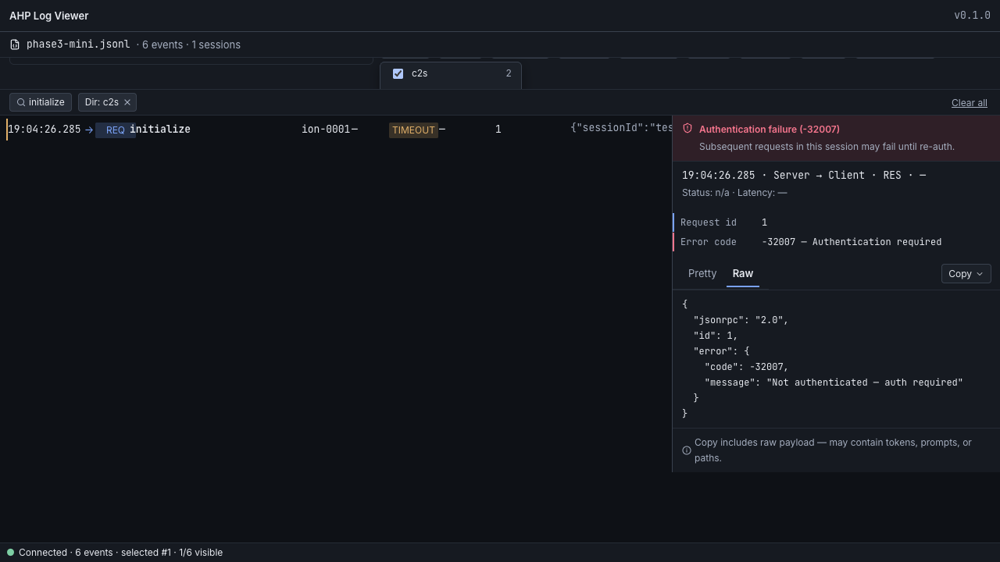

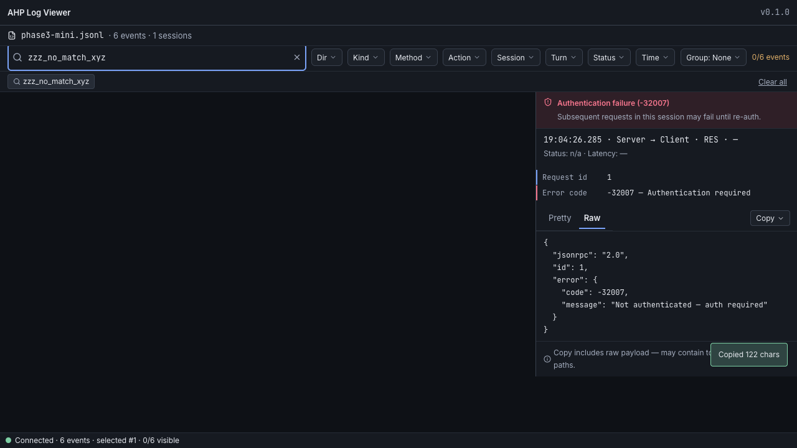

## Filtering events

Click any of the **8 facet chips** in the filter bar to open a popover with the distinct values for that facet and their counts:

| Chip | Filters by |
|------|-----------|
| **Dir** | Direction (`c2s` / `s2c`) |
| **Kind** | Event kind (`request` / `response` / `action` / `protocol-notification`) |
| **Method** | RPC method name |
| **Action** | Action type family |
| **Session** | Session ID, shortened into a readable label when possible |
| **Turn** | Turn ID (last 6 chars shown) |
| **Status** | Correlation status (`ok` / `error` / `timeout` / pending) |
| **Time** | Time range (from / to) |

Selecting a value within a popover adds an **active chip** below the filter bar. Multiple values within the same facet are OR-combined; values across different facets are AND-combined.

- Click **✕** on an individual chip to remove that filter.
- Click **Clear all** to reset all active filter chips. The search query is cleared separately from the search input or with **`Esc`**.

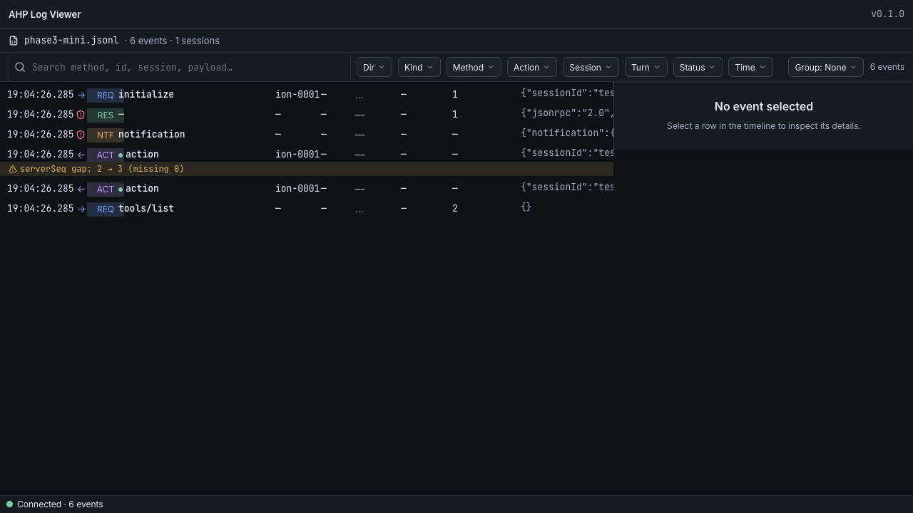

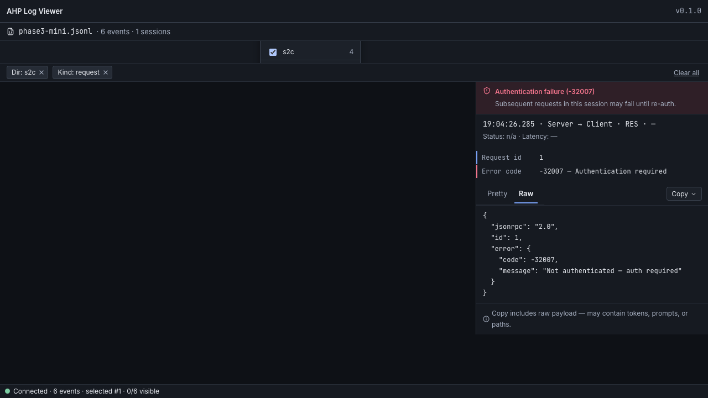

## Grouping by session / turn

Use the **Group: None** toggle (right end of the filter bar) to restructure the timeline into logical groups:

| Mode | Effect |
|------|--------|
| **None** | Flat chronological order (default) |
| **Session** | One group header per session; shows a readable session label, event count, and duration |
| **Session + Turn** | Nested sub-headers per turn inside each session |

Group headers are visual-only rows — keyboard navigation (Up/Down/Home/End) moves through event rows only, skipping headers.

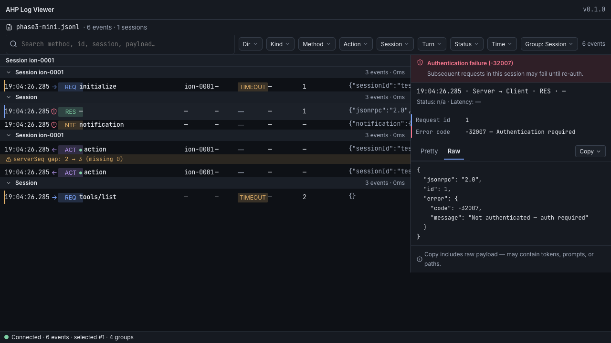

### Gap banners

When the `serverSeq` field advances by more than 1 between consecutive events in the same session, a **gap banner** is inserted above the next event. The banner shows the missing range so you can tell at a glance that events were dropped or lost.


## Inspecting event details

Click any row in the timeline to open the **detail panel** on the right.

### Summary strip

The top of the panel shows the core AHP fields in a structured strip with colored type stripes:
- Session ID, Turn ID, Key/Request ID
- Direction, kind, and RPC method
- Correlation status and latency
- Error code (highlighted in destructive color if present)
- Authentication failure banner (🔒) when the response carries error code `-32007`

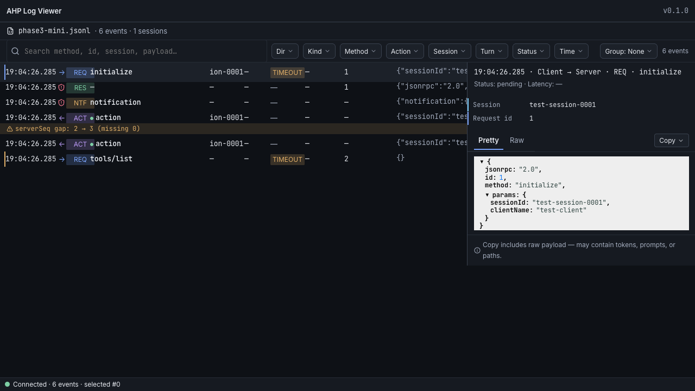


### Pretty vs Raw tab

- **Pretty** — expandable JSON tree rendered by react-json-view-lite. It opens expanded by default through the useful AHP nesting levels so fields under `params`, `action`, `notification`, tool calls, and results are immediately visible. Click a node label or its +/- marker to collapse or expand it. Payloads larger than 256 KB show a truncation warning.
- **Raw** — monospace `<pre>` block containing the full raw JSON for copy-paste.

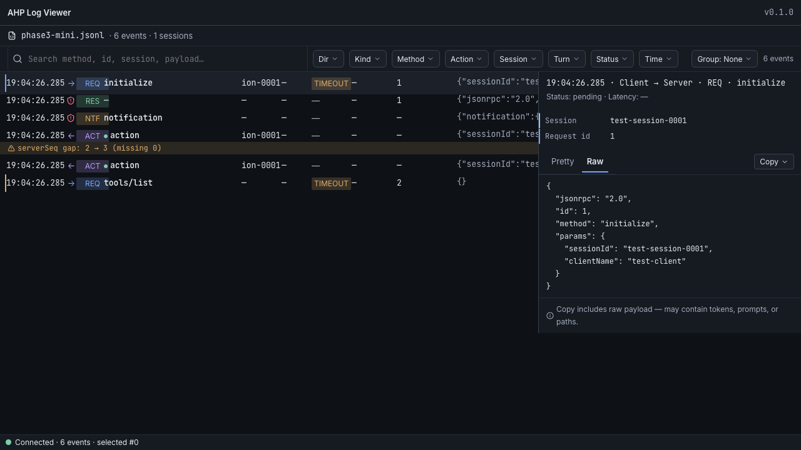


### Copy menu

The **Copy ▾** button opens a menu with three options:

| Option | Copies |
|--------|--------|
| Copy raw JSON | The full `raw` payload as JSON |
| Copy pretty JSON | Human-formatted (2-space indent) JSON |
| Copy summary | The Summary strip fields as plain text |

A brief **"Copied N chars"** toast appears at the bottom-right to confirm the clipboard write.

**Privacy note:** The raw payload may contain tokens, prompts, or file paths. The copy menu shows a reminder; keep this in mind when pasting into logs or tickets.

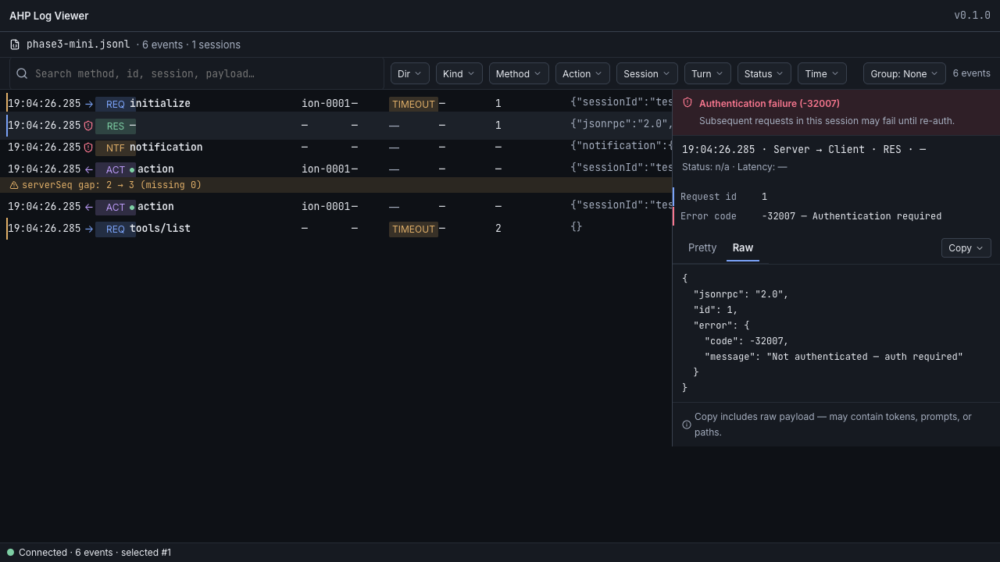

### Reducer-backed state inspection and pinned comparison

For logs that include AHP snapshots and server action envelopes, select a timeline row and click **State at this point** in the detail panel. The viewer reconstructs reducer state locally for that event index, then lists available resources such as `root`, `session`, and `terminal`.

1. Select a row with state history.
2. Click **State at this point**.
3. Choose a resource, for example `session copilot:/session/1`.
4. Read the aggregate and selected-resource confidence labels. **Complete** means the relevant baseline and action stream were available; **Partial** or **Unknown** means the diagnostics should be read before treating the state as authoritative.
5. Expand **Replay diagnostics** to see missing baselines, server sequence gaps, unknown action types, ignored client intents, and cache status.
6. Click **Pin state point** to keep the selected resource state in memory.
7. Select a later row, open the same resource, and click **Pin state point** again.
8. The **Pinned comparison** panel shows both event points and **Changed top-level paths** so you can quickly see which top-level reducer fields changed.

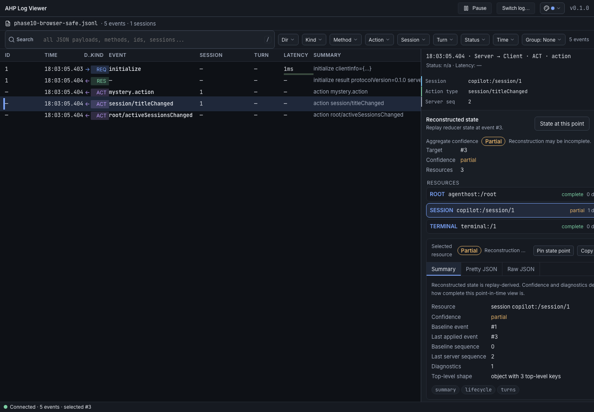

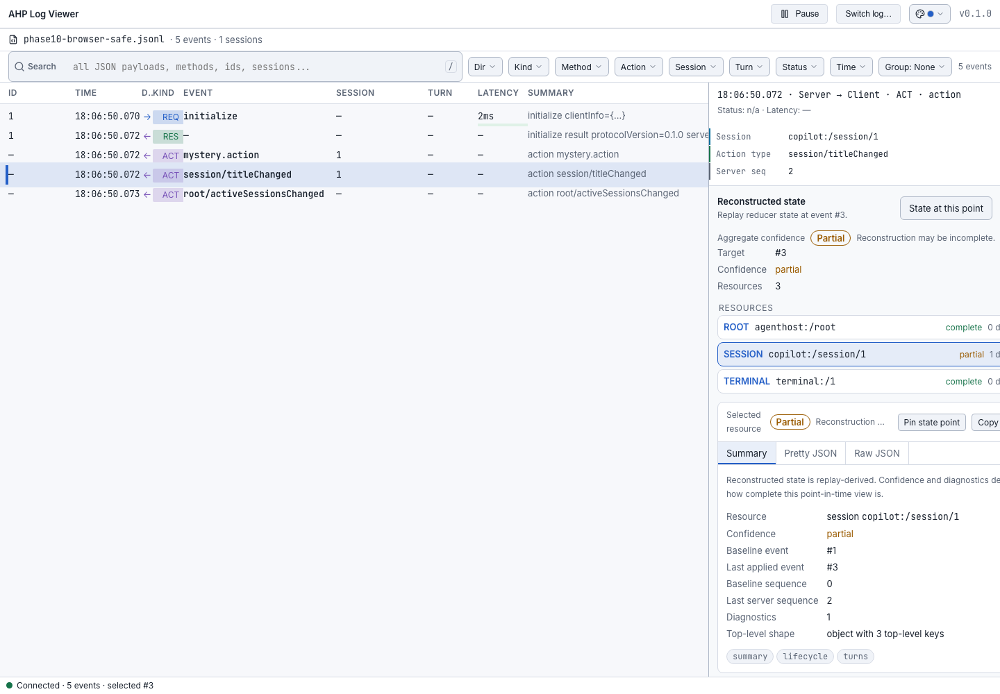

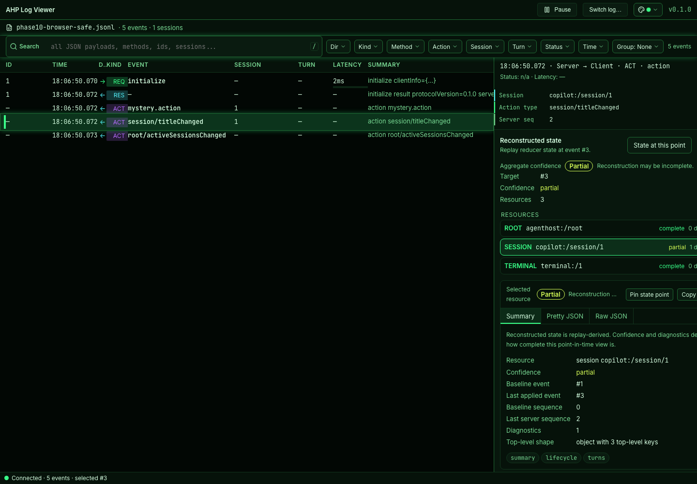

**Local-only privacy note:** reconstructed state, copied state, pinned state points, and pinned comparisons stay inside the local viewer process/browser memory. The viewer does not send state to telemetry, cloud services, or AI explanation endpoints. Screenshots in this guide use only synthetic Phase 10 fixture data.

### Keyboard shortcuts

| Key | Action |
|-----|--------|
| `/` | Focus the search input |
| `↑` / `↓` | Move selection up / down one visible row |
| `Page Up` / `Page Down` | Jump 10 rows |
| `Home` / `End` | Jump to first / last visible row |
| `Esc` | Clear search → clear filters → deselect row (in sequence) |

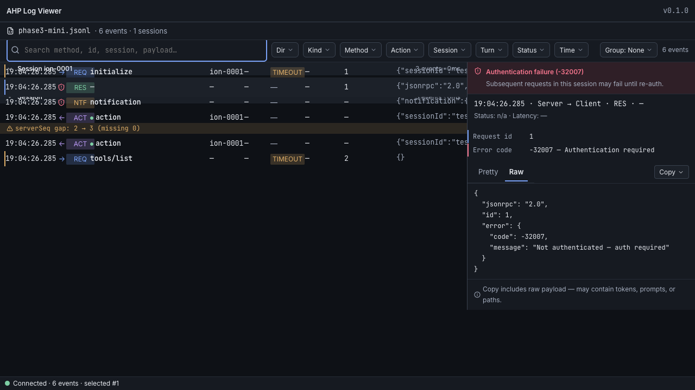


## Phase 5 Theme and Responsive Polish

Use the compact **Theme picker** in the header to switch between Dark, Light, and Hacker. The picker intentionally keeps the raw theme words inside the menu so the top-level UI stays compact. The selected theme persists in `localStorage["ahp-theme"]` and is separate from per-log viewer preferences.

Screenshots from the Phase 5 browser UAT matrix:

- Dark desktop: `screenshots/phase5/01-dark-desktop.png`
- Light desktop: `screenshots/phase5/02-light-desktop.png`
- Hacker desktop: `screenshots/phase5/03-hacker-desktop.png`
- Dark laptop drawer: `screenshots/phase5/04-laptop-drawer-dark.png`
- Hacker laptop drawer: `screenshots/phase5/05-laptop-drawer-hacker.png`
- Narrow light flow: `screenshots/phase5/06-narrow-light.png`
- Wide dark layout: `screenshots/phase5/07-wide-dark.png`
- Ultra-wide hacker layout: `screenshots/phase5/08-ultrawide-hacker.png`
- Empty/no-results light state: `screenshots/phase5/09-empty-light.png`
- Error/parse-state hacker view: `screenshots/phase5/10-errors-hacker.png`

At widths below 1400px, selecting a row opens event details in a right-side overlay drawer with a **Close details** control. At desktop widths, details remain a resizable right rail. Search, filters, Pretty JSON, Raw JSON, pair highlighting, and live appended events continue to work in all themes.

Privacy note: raw payloads can contain sensitive prompt, token, path, or model-output data. The viewer stays local-only and test screenshots use scrubbed synthetic fixtures, but inspect real raw payloads before sharing screenshots.
